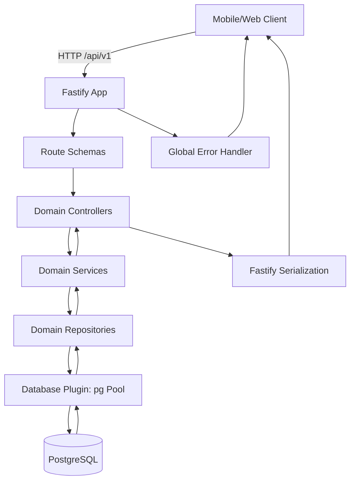

# Technical Design: Minha Saúde Feminina API

## Architectural Overview

The Minha Saúde Feminina API will evolve the current Fastify starter into a modular REST API under `/api/v1`, backed exclusively by PostgreSQL and prepared for local execution and Railway deployment.

The existing codebase currently contains a small `src/app.ts` with Fastify autoload for `src/plugins` and `src/routes`, plus sample routes/plugins. The implementation should keep Fastify autoload, but introduce the project steering structure:

```txt
src/
  app.ts
  config/
    env.ts
  infra/
    database/
      client.ts
      migrations/
      seeds/
  modules/
    categories/
      category.controller.ts
      category.dto.ts
      category.repository.ts
      category.route.ts
      category.schema.ts
      category.service.ts
      category.types.ts
    articles/
      article.controller.ts
      article.dto.ts
      article.repository.ts
      article.route.ts
      article.schema.ts
      article.service.ts
      article.types.ts
    authors/
    article-sources/
  plugins/
    database.ts
    error-handler.ts
  shared/
    errors/
    http/
    pagination/
  types/
  utils/
docs/
  database/
```

Routes will remain thin and schema-driven. Controllers will map Fastify requests/replies to service calls. Services will enforce business rules. Repositories will own SQL and PostgreSQL access. No route will access the database directly.

This first API version is public-read oriented and does not introduce authentication, because authentication and an administrative panel are roadmap items in the product PRD. Mutating CRUD endpoints are still designed now because the requirements ask for complete REST routes; before public production exposure, those endpoints should be protected by a future curator/admin authentication layer.

Key technical decisions:

- Fastify 5 with TypeScript strict mode.
- PostgreSQL with SQL migrations, no ORM and no schema sync.
- `pg` connection pool through a Fastify database plugin.
- JSON Schema validation/serialization in Fastify route schemas.
- UUID primary keys generated by PostgreSQL through `gen_random_uuid()`.
- PostgreSQL full-text search using Portuguese configuration and a GIN index.
- Soft delete through `deleted_at` for content entities to preserve audit history.
- Consistent error payload:

```json
{
  "error": true,
  "message": "Descrição",
  "code": "ERROR_CODE"
}
```

## Data Flow Diagram



## Component & Interface Definitions

### Shared Types

```ts
export type UUID = string;

export type PaginationQuery = {
  page?: number;
  pageSize?: number;
};

export type PaginatedResponse<T> = {
  data: T[];
  pagination: {
    page: number;
    pageSize: number;
    total: number;
    totalPages: number;
  };
};

export type ErrorResponse = {
  error: true;
  message: string;
  code: string;
};
```

### Category Types

```ts
export type Category = {
  id: UUID;
  name: string;
  slug: string;
  description: string;
  displayOrder: number;
  createdAt: string;
  updatedAt: string;
};

export type CreateCategoryInput = {
  name: string;
  slug: string;
  description: string;
  displayOrder?: number;
};

export type UpdateCategoryInput = Partial<CreateCategoryInput>;
```

Category module responsibilities:

- `category.route.ts`: registers `/api/v1/categories` routes and schemas.
- `category.controller.ts`: extracts params/query/body and delegates.
- `category.service.ts`: validates uniqueness, existence and deletion rules.
- `category.repository.ts`: executes SQL queries and maps DB rows.
- `category.schema.ts`: request/response JSON Schemas.

### Author Types

```ts
export type Author = {
  id: UUID;
  name: string;
  institution: string | null;
  bio: string | null;
  credentials: string | null;
  createdAt: string;
  updatedAt: string;
};

export type CreateAuthorInput = {
  name: string;
  institution?: string | null;
  bio?: string | null;
  credentials?: string | null;
};

export type UpdateAuthorInput = Partial<CreateAuthorInput>;
```

### Article Types

```ts
export type ArticleStatus = 'draft' | 'published' | 'archived';

export type Article = {
  id: UUID;
  categoryId: UUID;
  authorId: UUID;
  title: string;
  slug: string;
  summary: string;
  content: string;
  status: ArticleStatus;
  isFeatured: boolean;
  publishedAt: string | null;
  createdAt: string;
  updatedAt: string;
};

export type ArticleDetail = Article & {
  category: Pick<Category, 'id' | 'name' | 'slug'>;
  author: Pick<Author, 'id' | 'name' | 'institution' | 'credentials'>;
  sources: ArticleSource[];
};

export type ArticleListQuery = PaginationQuery & {
  categoryId?: UUID;
  categorySlug?: string;
  authorId?: UUID;
  status?: ArticleStatus;
  featured?: boolean;
};

export type CreateArticleInput = {
  categoryId: UUID;
  authorId: UUID;
  title: string;
  slug: string;
  summary: string;
  content: string;
  status?: ArticleStatus;
  isFeatured?: boolean;
  publishedAt?: string | null;
};

export type UpdateArticleInput = Partial<CreateArticleInput>;
```

Article module responsibilities:

- Enforce category and author existence before creation/update.
- Enforce unique active slug.
- Return only `published` and non-deleted articles for public list/detail/search/featured endpoints.
- Use explicit SQL selects to avoid overfetching and N+1 queries.

### Article Source Types

```ts
export type ArticleSource = {
  id: UUID;
  articleId: UUID;
  title: string;
  description: string | null;
  url: string | null;
  sourceOrder: number;
  createdAt: string;
  updatedAt: string;
};

export type CreateArticleSourceInput = {
  articleId: UUID;
  title: string;
  description?: string | null;
  url?: string | null;
  sourceOrder?: number;
};

export type UpdateArticleSourceInput = Partial<CreateArticleSourceInput>;
```

### Database Plugin Contract

```ts
import type { Pool, PoolClient, QueryResult, QueryResultRow } from 'pg';

export interface Database {
  pool: Pool;
  query<T extends QueryResultRow>(
    text: string,
    values?: readonly unknown[]
  ): Promise<QueryResult<T>>;
  transaction<T>(
    callback: (client: PoolClient) => Promise<T>
  ): Promise<T>;
}

declare module 'fastify' {
  interface FastifyInstance {
    db: Database;
  }
}
```

The database plugin will create one process-level pool, expose parameterized query helpers, close the pool during graceful shutdown and avoid logging SQL values that may contain health information.

## API Endpoint Definitions

All endpoints are prefixed with `/api/v1`. All JSON responses use `application/json`.

Common error responses:

- `400 VALIDATION_ERROR`
- `404 NOT_FOUND`
- `409 CONFLICT`
- `500 INTERNAL_SERVER_ERROR`

### Health

| Method | Path | Description |
|---|---|---|
| GET | `/health` | Service and database healthcheck |

Success `200`:

```json
{
  "status": "ok",
  "database": "ok"
}
```

### Categories

| Method | Path | Description |
|---|---|---|
| GET | `/api/v1/categories` | List categories |
| GET | `/api/v1/categories/:idOrSlug` | Get category by UUID or slug |
| POST | `/api/v1/categories` | Create category |
| PATCH | `/api/v1/categories/:id` | Update category |
| DELETE | `/api/v1/categories/:id` | Soft delete category when allowed |

Create request:

```json
{
  "name": "Saúde Menstrual",
  "slug": "saude-menstrual",
  "description": "Conteúdos sobre ciclo menstrual e cuidado cotidiano.",
  "displayOrder": 1
}
```

Category response:

```json
{
  "id": "uuid",
  "name": "Saúde Menstrual",
  "slug": "saude-menstrual",
  "description": "Conteúdos sobre ciclo menstrual e cuidado cotidiano.",
  "displayOrder": 1,
  "createdAt": "2026-05-12T00:00:00.000Z",
  "updatedAt": "2026-05-12T00:00:00.000Z"
}
```

List response:

```json
{
  "data": []
}
```

Deletion rule: if active articles exist for the category, return `409 CATEGORY_HAS_ARTICLES`; otherwise set `deleted_at`.

### Authors

| Method | Path | Description |
|---|---|---|
| GET | `/api/v1/authors` | List authors |
| GET | `/api/v1/authors/:id` | Get author |
| POST | `/api/v1/authors` | Create author |
| PATCH | `/api/v1/authors/:id` | Update author |
| DELETE | `/api/v1/authors/:id` | Soft delete author when allowed |

Create request:

```json
{
  "name": "Equipe de Medicina UNIFEBE",
  "institution": "UNIFEBE",
  "bio": "Conteúdo elaborado por estudantes de Medicina.",
  "credentials": "Estudantes de Medicina"
}
```

Deletion rule: if active articles exist for the author, return `409 AUTHOR_HAS_ARTICLES`; otherwise set `deleted_at`.

### Articles

| Method | Path | Description |
|---|---|---|
| GET | `/api/v1/articles` | List published articles with filters |
| GET | `/api/v1/articles/featured` | List featured published articles |
| GET | `/api/v1/articles/search` | Search published articles |
| GET | `/api/v1/articles/:idOrSlug` | Get published article detail |
| POST | `/api/v1/articles` | Create article |
| PATCH | `/api/v1/articles/:id` | Update article |
| DELETE | `/api/v1/articles/:id` | Soft delete article |

List query:

```txt
page=1&pageSize=20&categorySlug=gravidez&authorId=uuid&featured=true
```

Search query:

```txt
q=menstruação&page=1&pageSize=20
```

Create request:

```json
{
  "categoryId": "uuid",
  "authorId": "uuid",
  "title": "Entendendo o ciclo menstrual",
  "slug": "entendendo-o-ciclo-menstrual",
  "summary": "Uma explicação simples sobre fases do ciclo menstrual.",
  "content": "Texto completo do artigo...",
  "status": "published",
  "isFeatured": true,
  "publishedAt": "2026-05-12T00:00:00.000Z"
}
```

Article list item response:

```json
{
  "id": "uuid",
  "title": "Entendendo o ciclo menstrual",
  "slug": "entendendo-o-ciclo-menstrual",
  "summary": "Uma explicação simples sobre fases do ciclo menstrual.",
  "status": "published",
  "isFeatured": true,
  "publishedAt": "2026-05-12T00:00:00.000Z",
  "category": {
    "id": "uuid",
    "name": "Saúde Menstrual",
    "slug": "saude-menstrual"
  },
  "author": {
    "id": "uuid",
    "name": "Equipe de Medicina UNIFEBE"
  }
}
```

Article detail response adds `content` and `sources`.

Public read rule: list, detail, featured and search endpoints return only `status = 'published'` and `deleted_at IS NULL`.

### Article Sources

| Method | Path | Description |
|---|---|---|
| GET | `/api/v1/article-sources` | List sources, optionally by article |
| GET | `/api/v1/article-sources/:id` | Get source |
| POST | `/api/v1/article-sources` | Create source |
| PATCH | `/api/v1/article-sources/:id` | Update source |
| DELETE | `/api/v1/article-sources/:id` | Soft delete source |

List query:

```txt
articleId=uuid
```

Create request:

```json
{
  "articleId": "uuid",
  "title": "Ministério da Saúde",
  "description": "Referência institucional utilizada no artigo.",
  "url": "https://www.gov.br/saude",
  "sourceOrder": 1
}
```

## Database Schema Changes

The first migration will enable `pgcrypto`, create tables, constraints, indexes, triggers and seed the six MVP categories. All identifiers use `snake_case`.

```sql
CREATE EXTENSION IF NOT EXISTS pgcrypto;

CREATE OR REPLACE FUNCTION set_updated_at()
RETURNS trigger AS $$
BEGIN
  NEW.updated_at = now();
  RETURN NEW;
END;
$$ LANGUAGE plpgsql;

CREATE TABLE categories (
  id uuid PRIMARY KEY DEFAULT gen_random_uuid(),
  name text NOT NULL CHECK (length(trim(name)) > 0),
  slug text NOT NULL CHECK (slug ~ '^[a-z0-9]+(?:-[a-z0-9]+)*$'),
  description text NOT NULL CHECK (length(trim(description)) > 0),
  display_order integer NOT NULL DEFAULT 0 CHECK (display_order >= 0),
  created_at timestamptz NOT NULL DEFAULT now(),
  updated_at timestamptz NOT NULL DEFAULT now(),
  deleted_at timestamptz
);

CREATE UNIQUE INDEX categories_slug_active_uidx
  ON categories (slug)
  WHERE deleted_at IS NULL;

CREATE INDEX categories_display_order_idx
  ON categories (display_order, name)
  WHERE deleted_at IS NULL;

CREATE TRIGGER categories_set_updated_at
  BEFORE UPDATE ON categories
  FOR EACH ROW
  EXECUTE FUNCTION set_updated_at();

CREATE TABLE authors (
  id uuid PRIMARY KEY DEFAULT gen_random_uuid(),
  name text NOT NULL CHECK (length(trim(name)) > 0),
  institution text,
  bio text,
  credentials text,
  created_at timestamptz NOT NULL DEFAULT now(),
  updated_at timestamptz NOT NULL DEFAULT now(),
  deleted_at timestamptz
);

CREATE INDEX authors_name_idx
  ON authors (name)
  WHERE deleted_at IS NULL;

CREATE TRIGGER authors_set_updated_at
  BEFORE UPDATE ON authors
  FOR EACH ROW
  EXECUTE FUNCTION set_updated_at();

CREATE TABLE articles (
  id uuid PRIMARY KEY DEFAULT gen_random_uuid(),
  category_id uuid NOT NULL REFERENCES categories(id) ON UPDATE CASCADE ON DELETE RESTRICT,
  author_id uuid NOT NULL REFERENCES authors(id) ON UPDATE CASCADE ON DELETE RESTRICT,
  title text NOT NULL CHECK (length(trim(title)) > 0),
  slug text NOT NULL CHECK (slug ~ '^[a-z0-9]+(?:-[a-z0-9]+)*$'),
  summary text NOT NULL CHECK (length(trim(summary)) > 0),
  content text NOT NULL CHECK (length(trim(content)) > 0),
  status text NOT NULL DEFAULT 'draft' CHECK (status IN ('draft', 'published', 'archived')),
  is_featured boolean NOT NULL DEFAULT false,
  published_at timestamptz,
  search_vector tsvector GENERATED ALWAYS AS (
    setweight(to_tsvector('portuguese', coalesce(title, '')), 'A') ||
    setweight(to_tsvector('portuguese', coalesce(summary, '')), 'B') ||
    setweight(to_tsvector('portuguese', coalesce(content, '')), 'C')
  ) STORED,
  created_at timestamptz NOT NULL DEFAULT now(),
  updated_at timestamptz NOT NULL DEFAULT now(),
  deleted_at timestamptz,
  CONSTRAINT articles_published_at_required_chk
    CHECK (status <> 'published' OR published_at IS NOT NULL)
);

CREATE UNIQUE INDEX articles_slug_active_uidx
  ON articles (slug)
  WHERE deleted_at IS NULL;

CREATE INDEX articles_category_id_idx
  ON articles (category_id)
  WHERE deleted_at IS NULL;

CREATE INDEX articles_author_id_idx
  ON articles (author_id)
  WHERE deleted_at IS NULL;

CREATE INDEX articles_public_list_idx
  ON articles (published_at DESC, created_at DESC)
  WHERE deleted_at IS NULL AND status = 'published';

CREATE INDEX articles_featured_idx
  ON articles (published_at DESC, created_at DESC)
  WHERE deleted_at IS NULL AND status = 'published' AND is_featured = true;

CREATE INDEX articles_search_vector_gin_idx
  ON articles USING gin (search_vector);

CREATE TRIGGER articles_set_updated_at
  BEFORE UPDATE ON articles
  FOR EACH ROW
  EXECUTE FUNCTION set_updated_at();

CREATE TABLE article_sources (
  id uuid PRIMARY KEY DEFAULT gen_random_uuid(),
  article_id uuid NOT NULL REFERENCES articles(id) ON UPDATE CASCADE ON DELETE CASCADE,
  title text NOT NULL CHECK (length(trim(title)) > 0),
  description text,
  url text CHECK (url IS NULL OR url ~ '^https?://'),
  source_order integer NOT NULL DEFAULT 0 CHECK (source_order >= 0),
  created_at timestamptz NOT NULL DEFAULT now(),
  updated_at timestamptz NOT NULL DEFAULT now(),
  deleted_at timestamptz
);

CREATE INDEX article_sources_article_id_idx
  ON article_sources (article_id, source_order)
  WHERE deleted_at IS NULL;

CREATE TRIGGER article_sources_set_updated_at
  BEFORE UPDATE ON article_sources
  FOR EACH ROW
  EXECUTE FUNCTION set_updated_at();
```

MVP seed data:

```sql
INSERT INTO categories (name, slug, description, display_order)
VALUES
  ('Saúde Menstrual', 'saude-menstrual', 'Conteúdos sobre ciclo menstrual, sintomas e cuidado cotidiano.', 1),
  ('Saúde Sexual', 'saude-sexual', 'Conteúdos educativos sobre sexualidade, prevenção e cuidado.', 2),
  ('Gravidez', 'gravidez', 'Conteúdos sobre gestação, acompanhamento e sinais importantes.', 3),
  ('Pós-parto', 'pos-parto', 'Conteúdos sobre recuperação, amamentação e saúde após o parto.', 4),
  ('Prevenção', 'prevencao', 'Conteúdos sobre exames, vacinação e prevenção em saúde.', 5),
  ('Menopausa', 'menopausa', 'Conteúdos sobre climatério, menopausa e qualidade de vida.', 6)
ON CONFLICT DO NOTHING;
```

Search SQL shape:

```sql
SELECT
  articles.id,
  articles.title,
  articles.slug,
  articles.summary,
  articles.published_at,
  ts_rank(
    articles.search_vector,
    plainto_tsquery('portuguese', $1)
  ) AS rank
FROM articles
WHERE
  articles.deleted_at IS NULL
  AND articles.status = 'published'
  AND articles.search_vector @@ plainto_tsquery('portuguese', $1)
ORDER BY rank DESC, articles.published_at DESC
LIMIT $2 OFFSET $3;
```

Documentation to create during implementation:

```txt
docs/database/schema.sql
docs/database/mer.md
docs/database/entities.md
docs/database/decisions.md
```

## Security Considerations

- Validate every `params`, `query` and `body` payload using Fastify JSON Schema.
- Use parameterized SQL exclusively; never interpolate user input into SQL strings.
- Normalize and validate slugs server-side using the same pattern enforced by database checks.
- Return standardized errors without stack traces.
- Do not log article body content, tokens, connection strings or sensitive health-related request payloads.
- Keep public read endpoints limited to published and non-deleted articles.
- Treat mutating endpoints as internal/curator endpoints in this version; add JWT and role-based authorization before exposing them publicly.
- Use `DATABASE_URL`, `PORT` and `NODE_ENV` from environment variables; never hardcode secrets.
- Configure graceful shutdown so Railway deployments close the PostgreSQL pool cleanly.
- Keep CORS restrictive when a production frontend origin is known.

## Test Strategy

### Unit Tests

- Services:
  - category slug conflict.
  - category deletion blocked by active articles.
  - article creation rejects missing category or author.
  - article publication requires `publishedAt`.
  - author deletion blocked by active articles.
  - source creation rejects missing article.
- Shared utilities:
  - pagination normalization.
  - error mapping.
  - slug validation if implemented outside schema only for reuse.

### Integration Tests

Use Fastify `inject()` with a test PostgreSQL database or isolated test schema.

Cover:

- `GET /health` returns service and database status.
- CRUD success, validation failure, not found and conflict cases for categories.
- CRUD success, validation failure, not found and conflict cases for authors.
- Article list filters by category, author and featured status.
- Article detail includes category, author and sources.
- Article search matches title, summary and content.
- Featured endpoint returns only `published`, `is_featured = true`, non-deleted articles.
- Source CRUD validates URL and article relationship.
- Soft-deleted records are excluded from public reads.

### Database Verification

- Apply migrations from scratch.
- Verify seed creates the six MVP categories.
- Verify unique active slugs.
- Verify foreign key behavior for category, author and article sources.
- Verify GIN search index exists.
- Verify `updated_at` changes on update triggers.

### E2E Scope

Full browser E2E is not required for this backend-only phase. A lightweight HTTP smoke suite may be added later to validate a deployed Railway environment against `/health`, category listing, article listing, search and featured articles.

## Implementation Notes for Next Phase

- Replace or remove starter sample route content that is not part of the API contract.
- Refactor `src/app.ts` toward a testable app factory so integration tests can call `fastify.inject()`.
- Add migration and seed scripts to `package.json`.
- Add PostgreSQL dependency and test runner dependency during implementation planning.
- Keep endpoint paths in English technical naming, while business content remains in Portuguese.
- Do not create authentication in this feature unless requirements are expanded; document mutating endpoints as not ready for public exposure until protected.

