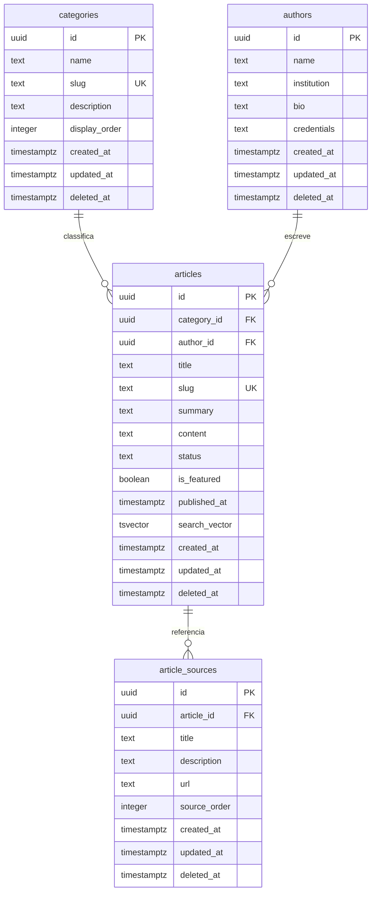

# MER - Minha Saúde Feminina API

Cardinalidade:

- Uma categoria possui zero ou muitos artigos.
- Um autor possui zero ou muitos artigos.
- Um artigo possui zero ou muitas fontes.
- Uma fonte pertence a exatamente um artigo.
